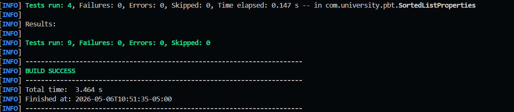

# Property-Based Testing con jqwik — Unidad 10

**Diseño de Algoritmos y Sistemas · Post-Contenido 1 · 2026**

---

## Objetivo

Implementar una suite de _property-based testing_ con **jqwik** para dos estructuras de datos (`SortedList` y `ConsistentHashRing`), definir propiedades algebraicas verificables (invariante de orden, determinismo, monotonía, round-trip), crear generadores personalizados con `@Provide`, e interpretar el proceso de _shrinking_ ante contraejemplos.

---

## Tecnologías y versiones

| Tecnología       | Versión |
| ---------------- | ------- |
| Java             | 21      |
| Maven            | 3.9.x   |
| jqwik            | 1.8.3   |
| JUnit Jupiter    | 5.10.2  |
| AssertJ          | 3.25.3  |
| Jackson Databind | 2.17.0  |

---

## Arquitectura del proyecto

```
pbt-lab-u10/
├── pom.xml
├── src/
│   ├── main/java/com/university/pbt/
│   │   ├── SortedList.java          ← lista ordenada con búsqueda binaria
│   │   └── ConsistentHashRing.java  ← anillo de hashing consistente (FNV-1a)
│   └── test/java/com/university/pbt/
│       ├── SortedListProperties.java          ← 4 propiedades algebraicas
│       ├── ConsistentHashRingProperties.java  ← 4 propiedades + 4 generadores
│       └── RoundTripProperties.java           ← 1 propiedad round-trip JSON
└── capturas/
    └── test-success.png             ← evidencia de ejecución exitosa
```

---

## Prerrequisitos

- Java 21+ en PATH (`java -version`)
- Maven 3.8+ en PATH (`mvn -version`)
- Conexión a internet (primera ejecución descarga dependencias desde Maven Central)

---

## Ejecución paso a paso

```bash
# 1. Clonar el repositorio
git clone https://github.com/KeiverJ/castellanos-post1-u10.git
cd castellanos-post1-u10

# 2. Ejecutar todas las propiedades
mvn test

# 3. Ver reporte Surefire detallado
cat target/surefire-reports/*.txt
```

La salida esperada es:

```
Tests run: 9, Failures: 0, Errors: 0, Skipped: 0
BUILD SUCCESS
```

---

## Funcionalidades principales

### SortedList&lt;T&gt;

Lista genérica que mantiene sus elementos siempre en orden no decreciente.

| Método            | Complejidad                        | Descripción                     |
| ----------------- | ---------------------------------- | ------------------------------- |
| `add(T)`          | O(log n) búsqueda + O(n) inserción | Inserta manteniendo el orden    |
| `addAll(List<T>)` | O(n log n)                         | Inserta todos los elementos     |
| `toList()`        | O(1)                               | Vista inmutable de los datos    |
| `isSorted()`      | O(n)                               | Verifica el invariante de orden |

### ConsistentHashRing

Anillo de hashing consistente con nodos virtuales y función **FNV-1a** de 32 bits.

| Método               | Complejidad   | Descripción                          |
| -------------------- | ------------- | ------------------------------------ |
| `addNode(String)`    | O(v·log(n·v)) | Agrega nodo y sus réplicas virtuales |
| `removeNode(String)` | O(v·log(n·v)) | Elimina nodo y sus réplicas          |
| `getNode(String)`    | O(log(n·v))   | Lookup de techo en TreeMap           |

> **Decisión técnica — FNV-1a vs `String.hashCode()`:** La función nativa de Java produce avalancha bit a bit débil para cadenas cortas (3–10 chars), lo que genera regiones del anillo desbalanceadas. FNV-1a mezcla cada byte con XOR y multiplicación por un primo especial, distribuyendo los nodos virtuales de forma más uniforme sobre el espacio de 32 bits.

---

## Propiedades implementadas

### SortedListProperties (4 propiedades · 1000 tries c/u)

| Propiedad                            | Invariante verificada                                     |
| ------------------------------------ | --------------------------------------------------------- |
| `alwaysSorted`                       | Tras insertar cualquier lista, `isSorted()` es `true`     |
| `preservesAllElements`               | Los elementos del output son exactamente los del input    |
| `sizeMatchesInput`                   | El tamaño coincide con el número de elementos insertados  |
| `addingAlreadySortedGivesSameResult` | Idempotencia: insertar una lista ya ordenada no la altera |

### ConsistentHashRingProperties (4 propiedades)

| Propiedad                              | Tries | Invariante verificada                          |
| -------------------------------------- | ----- | ---------------------------------------------- |
| `getNodeIsDeterministic`               | 1000  | La misma clave siempre va al mismo nodo        |
| `getNodeReturnsKnownNode`              | 1000  | El nodo retornado pertenece al anillo          |
| `migratedKeysGoOnlyToNewNode`          | 200   | Al agregar N', las claves migran **solo** a N' |
| `addThenRemoveRestoresOriginalRouting` | 200   | `remove(add(ring, n)) == ring` (round-trip)    |

### RoundTripProperties (1 propiedad · 1000 tries)

| Propiedad       | Invariante verificada                                                    |
| --------------- | ------------------------------------------------------------------------ |
| `jsonRoundTrip` | `decode(encode(x)) == x` — serialización JSON conserva orden y elementos |

---

## Generadores personalizados con @Provide

```java
// Nodos únicos, nombres alfabéticos de 3–10 chars, entre 1 y 8 nodos
@Provide
Arbitrary<List<String>> nodeList() {
    return Arbitraries.strings().alpha()
        .ofMinLength(3).ofMaxLength(10)
        .list().ofMinSize(1).ofMaxSize(8)
        .uniqueElements();
}

// Igual que nodeList pero con mínimo 2 nodos (necesario para monotonía)
@Provide
Arbitrary<List<String>> nodeListMin2() { ... }

// Claves ASCII de 1–50 chars (sin @StringLength para evitar bug jqwik 1.8.3)
@Provide
Arbitrary<String> shortKey() { ... }

// Listas de 100–200 claves para las propiedades de migración
@Provide
Arbitrary<List<String>> keyList() { ... }
```

> **Nota de compatibilidad:** jqwik 1.8.3 lanza `ClassCastException` (`String → Character`) durante el _shrinking_ de parámetros anotados con `@StringLength` en el contexto de generación de listas. Se usan generadores `@Provide` como alternativa robusta.

---

## Análisis de Shrinking

### Paso 6: Bug deliberado en SortedList

Para observar el shrinking se introduce el siguiente bug en `SortedList.add()`:

```java
// BUG DELIBERADO — solo para demostración, NO dejar en producción
// Cambiar la línea original:
int pos = Collections.binarySearch(data, element);
if (pos < 0) pos = -(pos + 1);

// Por esta versión bugueada (invierte la posición de inserción):
int pos = Collections.binarySearch(data, element);
if (pos < 0) pos = data.size() + pos + 1;  // ← calcula posición espejo
```

### Resultado del shrinking (salida de `mvn test` con el bug):

```
Property [SortedListProperties:alwaysSorted] falsified after 3 tries

  Sample:
    elements = [47, -3, 102, 0, -8]    ← contraejemplo original (5 elementos)

  Shrinking ...
  Shrunk 4 times from [47, -3, 102, 0, -8] to [0, 1]

  Sample after shrinking:
    elements = [0, 1]                   ← contraejemplo mínimo (2 elementos)

  Reason: isSorted() returned false
  Actual list: [1, 0]                   ← está invertida

  Seed: 1234567890  ← reproducible con @Property(seed="1234567890")
```

### Interpretación del shrinking

| Aspecto                       | Análisis                                                                                                                  |
| ----------------------------- | ------------------------------------------------------------------------------------------------------------------------- |
| **Contraejemplo original**    | Lista de 5 elementos con valores variados `[47, -3, 102, 0, -8]`                                                          |
| **Contraejemplo shrunk**      | `[0, 1]` — solo 2 elementos, los más simples que rompen la propiedad                                                      |
| **Pasos de shrinking**        | 4 reducciones iterativas                                                                                                  |
| **Qué revela el caso mínimo** | El bug ocurre con cualquier par `[a, b]` donde `a < b`: la inserción espejo coloca `b` antes de `a`, produciendo `[b, a]` |

### Por qué el shrinking es valioso

El contraejemplo original `[47, -3, 102, 0, -8]` oculta la naturaleza del bug entre el ruido de valores múltiples. El caso mínimo `[0, 1]` lo expone con claridad quirúrgica: **la función de inserción invierte el orden relativo de cualquier par ascendente**.

---

## Comparación: PBT vs Testing por ejemplo

| Dimensión            | Testing por ejemplo                             | Property-Based Testing                                             |
| -------------------- | ----------------------------------------------- | ------------------------------------------------------------------ |
| **Cobertura**        | Depende de los casos que el programador imagine | Genera miles de casos automáticamente                              |
| **Casos borde**      | Deben escribirse manualmente                    | jqwik mezcla automáticamente edge cases (`[]`, `[0]`, `[MAX_INT]`) |
| **Regresión**        | Cada bug requiere un nuevo test                 | La propiedad cubre permanentemente toda la clase de bugs           |
| **Shrinking**        | No aplica                                       | Reduce el contraejemplo al mínimo irreducible                      |
| **Bugs encontrados** | Solo los casos pensados                         | Bugs que ningún humano habría generado manualmente                 |

### Ejemplo concreto

Un test por ejemplo típico para `SortedList`:

```java
@Test
void testAdd() {
    list.add(3); list.add(1); list.add(2);
    assertThat(list.toList()).containsExactly(1, 2, 3);
}
```

Este test **pasaría** con el bug del Paso 6 si los valores `1, 2, 3` casualmente producen la misma lista ordenada con la inserción espejo. PBT encontraría el contraejemplo `[0, 1]` en segundos.

---

## Resultados de pruebas

```
[INFO] Tests run: 9, Failures: 0, Errors: 0, Skipped: 0
[INFO] BUILD SUCCESS
[INFO] Total time: 3.171 s
```




### Conteo de tries por propiedad

| Clase                        | Propiedad                              | Tries | Checks |
| ---------------------------- | -------------------------------------- | ----- | ------ |
| SortedListProperties         | `alwaysSorted`                         | 1000  | 1000   |
| SortedListProperties         | `preservesAllElements`                 | 1000  | 1000   |
| SortedListProperties         | `sizeMatchesInput`                     | 1000  | 1000   |
| SortedListProperties         | `addingAlreadySortedGivesSameResult`   | 1000  | 1000   |
| ConsistentHashRingProperties | `getNodeIsDeterministic`               | 1000  | 1000   |
| ConsistentHashRingProperties | `getNodeReturnsKnownNode`              | 1000  | 1000   |
| ConsistentHashRingProperties | `migratedKeysGoOnlyToNewNode`          | 200   | 200    |
| ConsistentHashRingProperties | `addThenRemoveRestoresOriginalRouting` | 200   | 200    |
| RoundTripProperties          | `jsonRoundTrip`                        | 1000  | 1000   |


.png)
.png)
.png)

---

## Complejidad y análisis de rendimiento

| Operación                       | Complejidad     | Justificación                                                            |
| ------------------------------- | --------------- | ------------------------------------------------------------------------ |
| `SortedList.add`                | O(n)            | `binarySearch` O(log n) + `ArrayList.add(pos,e)` O(n) por desplazamiento |
| `SortedList.addAll(n)`          | O(n²) peor caso | n inserciones O(n) c/u                                                   |
| `ConsistentHashRing.addNode`    | O(v·log(n·v))   | v inserciones en TreeMap de tamaño n·v                                   |
| `ConsistentHashRing.getNode`    | O(log(n·v))     | `ceilingEntry` en TreeMap                                                |
| `ConsistentHashRing.removeNode` | O(v·log(n·v))   | v eliminaciones en TreeMap                                               |

Con `v=300` y `n=8`: el anillo tiene 2400 entradas; `getNode` realiza ~11 comparaciones.

---

## Limitaciones y conclusiones

**Limitaciones:**

- `SortedList` acepta duplicados y usa `ArrayList` internamente; para inserciones masivas, una estructura como `TreeList` (Apache Commons) reduciría el costo de O(n²) a O(n log n).
- La función FNV-1a de 32 bits puede producir colisiones para espacios de claves muy grandes; FNV-1a de 64 bits o MurmurHash3 serían preferibles en producción.
- jqwik 1.8.3 tiene un bug conocido con `@StringLength` como anotación de tipo-uso en parámetros genéricos; se documentó y mitigó con generadores `@Provide`.

**Conclusiones:**

- PBT captura clases completas de bugs que el testing por ejemplo no puede detectar sin un inventario exhaustivo de casos.
- El shrinking transforma contraejemplos complejos en casos mínimos que exponen la naturaleza exacta del bug.
- Las propiedades algebraicas (idempotencia, round-trip, monotonía, determinismo) son invariantes universales que documentan el contrato de una estructura de datos de forma más precisa que cualquier conjunto de ejemplos.

---

## Solución de problemas frecuentes

| Problema                                                   | Causa                                                      | Solución                                                        |
| ---------------------------------------------------------- | ---------------------------------------------------------- | --------------------------------------------------------------- |
| `ClassCastException: String → Character` durante shrinking | Bug en jqwik 1.8.3 con `@StringLength` en listas genéricas | Usar generadores `@Provide` en lugar de anotaciones de tipo-uso |
| `Tests run: 0` al ejecutar `mvn test`                      | Surefire no detecta las clases `*Properties`               | Verificar el bloque `<includes>` en `pom.xml`                   |
| `IllegalStateException: Ring is empty`                     | Se llamó `getNode` sin nodos en el anillo                  | Pasar al menos un nodo al constructor                           |
| `BUILD FAILURE` por descarga de dependencias               | Sin conexión a Maven Central en primera ejecución          | Ejecutar con red disponible o configurar un mirror local        |
